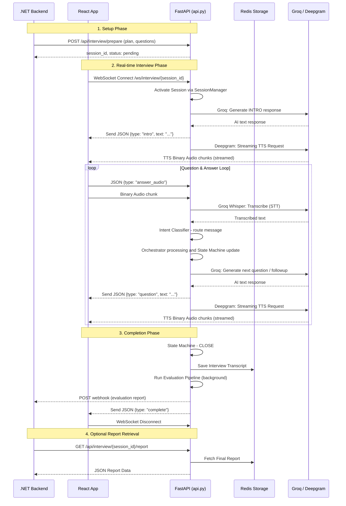
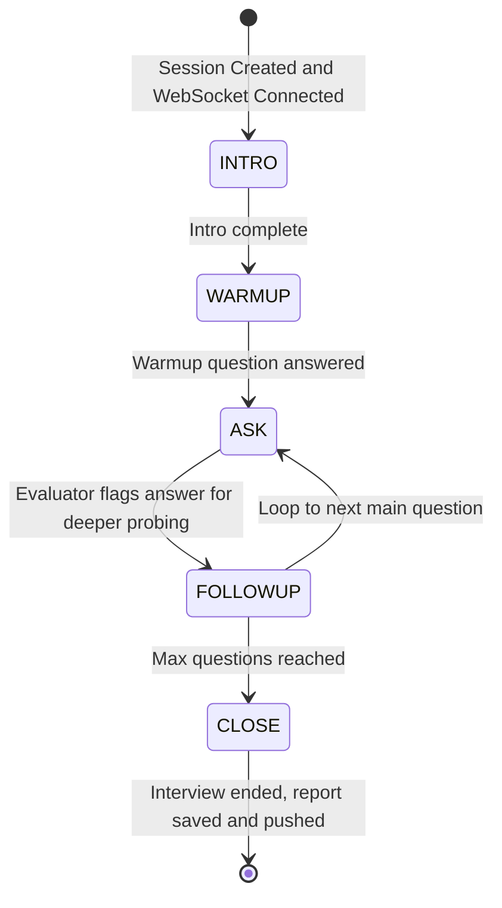

# 🤖 AI Interview System

A fully automated, voice-based AI technical interviewer powered by **Groq LLMs**, **Deepgram TTS**, and **Whisper STT**. The system conducts live real-time technical interviews over WebSockets, evaluates candidate answers against golden rubrics, and delivers a detailed score report automatically via webhook.

---

## Table of Contents

- [Overview](#overview)
- [Features](#features)
- [Architecture](#architecture)
- [Module Reference](#module-reference)
  - [API Layer](#1-apipy--fastapi-entry-point)
  - [Orchestrator](#2-orchestratorpy--interview-engine)
  - [State Machine](#3-state_machinepy--session-lifecycle)
  - [Conversation Manager](#4-conversationpy--context-manager)
  - [Intent Classifier](#5-intent_classifierpy--intent-classifier)
  - [Evaluator Package](#6-evaluator--evaluation-pipeline)
  - [Prompts](#7-promptspy--llm-personas--instructions)
  - [Data Models](#8-modelspy--domain-data-structures)
  - [Session Manager](#9-sessionpy--in-memory-state)
  - [Storage](#10-storagepy--persistence-layer)
  - [STT](#11-sttpy--speech-to-text)
  - [TTS](#12-ttspy--text-to-speech)
- [Sequence Diagrams](#sequence-diagrams)
- [API Reference](#api-reference)
- [Configuration](#configuration)
- [Getting Started](#getting-started)
- [Docker Deployment](#docker-deployment)
- [CLI Sandbox](#cli-sandbox)
- [Testing](#testing)

---

## Overview

This project is a **middleware backend** for an AI-driven interview platform. An external service (e.g., a .NET backend) initialises a session with a candidate profile and a list of questions. A React frontend then connects via WebSocket to conduct the live voice interview. Once complete, the system automatically scores all answers and pushes the evaluation report to a configured webhook.

```
.NET Backend ──► POST /api/interview/prepare ──► FastAPI
React Frontend ◄─► WebSocket /ws/interview/{session_id} ◄─► FastAPI
FastAPI ──────────────────────────────────────────────────► Webhook (evaluation report)
```

---

## Features

| Feature | Detail |
|---|---|
| 🎙️ **Voice-based interviews** | Real-time bidirectional audio over WebSockets |
| 🧠 **LLM Interviewer** | Groq Llama 3 acting as "Alex", a senior technical interviewer |
| 🗂️ **Intent Classification** | 9-class LLM-based intent router handles repeats, skips, off-topic, cheating attempts, and more |
| 🔄 **State Machine** | Strictly enforces the INTRO → WARMUP → ASK → FOLLOWUP → CLOSE interview flow |
| 📝 **Automatic Evaluation** | Per-question scoring (0–100) against golden answers with covered/missing requirements |
| 📊 **Overall Summary** | Role-aware holistic performance summary generated by a senior hiring manager persona |
| 🔔 **Webhook Push** | Final report is pushed automatically to the .NET backend after interview ends |
| 💾 **Hybrid Storage** | Redis primary storage with in-memory fallback |
| 🐳 **Docker Ready** | Single Dockerfile for containerised deployment |

---

## Architecture

### System Flow



### State Machine



---

## Module Reference

### 1. `api.py` — FastAPI Entry Point

The application entry point. Exposes all REST and WebSocket interfaces.

**REST Endpoints:**
- `POST /api/interview/prepare` — Called by the .NET backend to initialise a session with candidate data, questions, and golden answers.
- `GET /api/interview/{session_id}/report` — Fetch the final evaluation report for a completed session.

**WebSocket Endpoint:**
- `WS /ws/interview/{session_id}` — The live interview channel. Handles bidirectional JSON messages and binary audio streams.

After the WebSocket closes, `api.py` automatically triggers the evaluation pipeline in the background and POSTs the resulting report to the configured `WEBHOOK_URL`.

---

### 2. `orchestrator.py` — Interview Engine

The `InterviewOrchestrator` is the central brain of a single session. It:
- Coordinates the LLM (Groq API), conversation history, and state machine.
- Generates role-appropriate prompts for each interview phase.
- Routes through the intent classifier to decide the correct response action.
- Compiles and saves the final interview transcript and report to Redis.

---

### 3. `state_machine.py` — Session Lifecycle

Defines `InterviewStateMachine`, which enforces a strictly ordered interview flow:

```
INTRO → WARMUP → ASK ↔ FOLLOWUP → CLOSE
```

Illegal transitions raise errors, preventing the interview from jumping out of sequence.

---

### 4. `conversation.py` — Context Manager

Manages `ConversationHistory` for the Groq LLM API. It:
- Formats the sequence of messages into the Groq chat format.
- Injects contextual metadata (candidate profile, current question) into the context.
- Prunes history when it exceeds **12 turns** to stay within the context window.
- Contains logic to determine whether a candidate's answer is shallow enough to warrant a follow-up probe.

---

### 5. `intent_classifier.py` — Intent Classifier

Before the orchestrator acts on a candidate's message, the intent classifier determines **what the candidate is trying to do**. This prevents cheating, handles edge cases gracefully, and routes the orchestrator to the correct response path.

**Model:** `llama-3.1-8b-instant` via Groq (low-latency, fast classification)

**Classified Intents (9 classes):**

| Intent | Description |
|---|---|
| `technical_answer` | Any attempt to answer the question (correct, incorrect, partial, or "I don't know") |
| `clarification` | Candidate asks for a term or the question to be explained |
| `repeat_question` | Candidate asks to hear the question again |
| `skip_question` | Candidate wants to move on to a different question |
| `answer_seeking` | Candidate asks for a hint, the answer, code, or a solution |
| `off_topic` | Message is completely unrelated to the interview |
| `small_talk` | Greetings, thanks, or casual chat |
| `end_interview` | Candidate wants to stop the interview |
| `unknown` | Intent cannot be determined with confidence |

**Response shape:**
```json
{
  "intent": "technical_answer",
  "confidence": 0.97,
  "reason": "Candidate is providing an explanation of the concept."
}
```

**Key Classification Rules:**
- `"I don't know"` → always `technical_answer`, never `answer_seeking`.
- Only `answer_seeking` if the candidate **explicitly** requests help, hints, or the answer.
- Candidate repeating the question to themselves aloud is `technical_answer`, not `clarification`.
- When multiple intents are possible, the most specific one wins.

---

### 6. `evaluator/` — Evaluation Pipeline

A self-contained package that runs after the interview ends, automatically scoring all answers and generating a holistic performance summary.

#### `evaluator/agent.py` — Evaluator Agent

**Model:** `openai/gpt-oss-120b` (configurable via `EVALUATOR_MODEL` in `api_keys.json`)

Provides two functions:

**`evaluate_answer(question, golden_answer, candidate_answer)`**

Scores a single Q&A pair. Because answers come from speech transcripts, the evaluator is explicitly instructed to evaluate **intended meaning**, not surface form, tolerating STT errors, grammar mistakes, and repeated words.

Returns:
```json
{
  "question": "What is the difference between a process and a thread?",
  "score": 82,
  "covered_requirements": ["memory isolation", "scheduling", "overhead"],
  "missing_requirements": ["inter-process communication overhead detail"]
}
```

**`generate_overall_summary(candidate_name, job_role, level, evaluations)`**

Generates a concise 1–2 sentence holistic performance summary from a senior hiring manager's perspective, factoring in the role and seniority level expected.

---

#### `evaluator/pipeline.py` — Evaluation Pipeline

Orchestrates the full post-interview evaluation flow:

1. **Fetch** the session transcript from Redis (`interview_report:{session_id}`)
2. **Filter** transcript entries to only those with `type_of_question == "technical"`, skipping any entry missing a golden answer or candidate response
3. **Evaluate** each valid Q&A pair with the evaluator agent
4. **Aggregate** scores and compute the average
5. **Generate** the overall performance summary

Final report shape:
```json
{
  "session_id": "...",
  "candidate_name": "...",
  "job_role": "...",
  "level": "...",
  "average_score": 74.5,
  "overall_summary": "Ahmed demonstrated a solid understanding of core backend concepts...",
  "evaluations": [
    {
      "question": "...",
      "score": 82,
      "covered_requirements": ["..."],
      "missing_requirements": ["..."]
    }
  ]
}
```

---

#### `evaluator/router.py` — Evaluator Router *(Deprecated)*

Previously exposed `POST /evaluator/evaluate/{session_id}` for the .NET backend to manually trigger evaluation. **Now deprecated** — evaluation is fully automatic and push-based via webhook after the WebSocket closes. No manual polling required.

---

### 7. `prompts.py` — LLM Personas & Instructions

Stores all system and user prompt templates for the two LLM agents:

- **Interviewer Agent ("Alex"):** A senior technical interviewer persona. Prompts are dynamically formatted with the candidate's name, role, skills, and current interview phase to produce contextually appropriate questions.
- **Evaluator Agent:** An impartial grading engine that strictly compares candidate answers to golden answers without empathy or hints.

---

### 8. `models.py` — Domain Data Structures

Pydantic v2 models representing the core domain concepts:

| Model | Description |
|---|---|
| `Candidate` | Name, email, role, experience, skills, resume summary |
| `ScoreDimension` | A single rubric dimension with a 0–10 score |
| `Score` | Full evaluation result: overall score, dimensions, key points covered/missed, strengths, improvements, follow-up flag |
| `Answer` | A single Q&A pair with optional score, follow-up flag, and timestamp |
| `Interview` | Top-level session: candidate, answers, state, difficulty, type, summary |

**Enums:** `DifficultyLevel` (easy/medium/hard), `InterviewType` (technical/behavioral/system_design/general)

---

### 9. `session.py` — In-Memory State

Implements `SessionManager`, which tracks all active and pending interviews in-memory using dictionaries. Handles:
- Moving sessions from `PENDING` → `ACTIVE` when a WebSocket connects
- Moving sessions from `ACTIVE` → `COMPLETED` when the interview closes
- Cleaning up stale or abandoned sessions

---

### 10. `storage.py` — Persistence Layer

Implements `HybridReportStorage`:
- **Primary:** Saves completed interview reports to **Redis**.
- **Fallback:** If Redis is unavailable, stores the report in RAM within `SessionManager`.

This ensures the system degrades gracefully even without a Redis connection during development.

---

### 11. `stt.py` — Speech-To-Text

Wraps the **Groq Whisper Large V3** API.
- Accepts binary audio packets streamed from the WebSocket client.
- Transcribes candidate speech into text for the orchestrator.
- Injects technical keywords (from the candidate's skills list) as hints to improve accuracy on domain-specific terminology.
- Handles language detection automatically.

---

### 12. `tts.py` — Text-To-Speech

Wraps the **Deepgram Aura TTS** API (default voice: `aura-2-orion-en`).
- Converts the AI interviewer's text responses into natural-sounding speech.
- Supports **streaming** (audio chunks sent back to the frontend immediately for near-instant playback) and full file synthesis.

---

## API Reference

### `POST /api/interview/prepare`

Initialise an interview session.

**Request Body:**
```json
{
  "candidate": {
    "name": "Ahmed Al-Rashid",
    "email": "ahmed@example.com",
    "role": "Backend Engineer",
    "experience_years": 3,
    "skills": ["Python", "FastAPI", "PostgreSQL"]
  },
  "questions": [
    {
      "core_question": "What is the GIL in Python?",
      "golden_answer": "The Global Interpreter Lock is a mutex that...",
      "type_of_question": "technical"
    }
  ],
  "job_role": "Backend Engineer",
  "level": "Mid"
}
```

**Response:**
```json
{
  "session_id": "a1b2c3d4-...",
  "status": "pending"
}
```

---

### `WS /ws/interview/{session_id}`

Real-time interview WebSocket. Sends and receives JSON messages and binary audio.

**Client → Server (JSON):**
```json
{ "type": "answer_text", "text": "I think the GIL prevents true thread parallelism..." }
{ "type": "answer_audio" }
{ "type": "skip" }
{ "type": "repeat" }
```

**Server → Client (JSON):**
```json
{ "type": "intro",    "text": "Hello Ahmed, I'm Alex..." }
{ "type": "question", "text": "Can you explain the GIL?" }
{ "type": "followup", "text": "Can you elaborate on the impact..." }
{ "type": "complete", "text": "Thank you, the interview is now complete." }
```

TTS binary audio frames are streamed after each JSON text message.

---

### `GET /api/interview/{session_id}/report`

Fetch the evaluation report for a completed session.

**Response:**
```json
{
  "session_id": "...",
  "candidate_name": "Ahmed Al-Rashid",
  "average_score": 74.5,
  "overall_summary": "Ahmed demonstrated solid backend fundamentals...",
  "evaluations": [...]
}
```

---

## Configuration

All secrets and configuration are stored in `api_keys.json` (gitignored) or set as environment variables.

| Key | Description |
|---|---|
| `GROQ_API_KEY` | Groq API key for LLM inference and Whisper STT |
| `DEEPGRAM_API_KEY` | Deepgram API key for TTS |
| `REDIS_URL` | Redis connection URL (e.g. `redis://localhost:6379`) |
| `WEBHOOK_URL` | URL where the evaluation report is POSTed after interview completion |
| `EVALUATOR_MODEL` | *(Optional)* Override the evaluator LLM. Defaults to `openai/gpt-oss-120b` |

---

## Getting Started

### Prerequisites

- Python 3.11+
- Redis *(optional — falls back to in-memory if unavailable)*
- API keys for Groq and Deepgram

### Installation

```bash
# 1. Clone the repository
git clone <repo-url>
cd ai_interviewer

# 2. Create and activate a virtual environment
python -m venv .venv
.venv\Scripts\activate      # Windows
source .venv/bin/activate   # macOS / Linux

# 3. Install dependencies
pip install -r requirements.txt

# 4. Configure your API keys
# Edit api_keys.json and fill in your GROQ_API_KEY, DEEPGRAM_API_KEY, REDIS_URL, WEBHOOK_URL
```

### Run the Server

```bash
uvicorn api:app --reload --port 8000
```

The API will be available at `http://localhost:8000`.  
Interactive API docs: `http://localhost:8000/docs`

---

## Docker Deployment

```bash
# Build the image
docker build -t ai-interviewer .

# Run the container (exposes port 7860)
docker run -p 7860:7860 --env-file .env ai-interviewer
```

> The Dockerfile is pre-configured for **Hugging Face Spaces** (port 7860) but works with any container host.

---

## CLI Sandbox

`interview_me.py` is a standalone interactive CLI that runs the complete interview in your terminal without requiring WebSockets or a running API server. Use it to develop and test prompts, scoring, and orchestrator logic quickly.

```bash
python interview_me.py
```

You play the role of the candidate by typing responses. The LLM interviewer asks questions and the evaluator scores your answers in real time.

---

## Testing

| File | Description |
|---|---|
| `auto_test.py` | Automated end-to-end test script |
| `test_webhook.py` | Tests the webhook push after interview completion |
| `test_ws_client.py` | WebSocket client simulation for load/integration testing |
| `interview_me.py` | Manual CLI sandbox for prompt/flow development |

```bash
# Run automated tests
python auto_test.py

# Simulate a WebSocket client
python test_ws_client.py

# Test webhook delivery
python test_webhook.py
```
