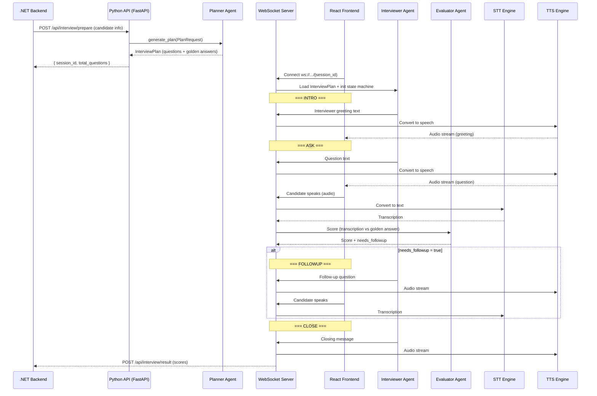

# Integration Architecture: Planner + Interviewer + WebSocket + STT/TTS

## Overview

Connect the existing **Planner** (retrieves questions from Qdrant) with the **Interviewer agent** (conducts the interview) via a **WebSocket** server, with **STT** (speech-to-text) and **TTS** (text-to-speech) for voice interaction from the React frontend.

## Full System Flow



## Data Flow: What Comes From Where

### Step 1: .NET Backend sends candidate info to Python API

The .NET backend already has the candidate data. It sends it to the Python API to prepare the interview:

```json
POST /api/interview/prepare
{
    "session_id": "auto-generated or from .NET",
    "candidate_name": "Doaa",
    "job_role": "Machine Learning Engineer", 
    "level": "Junior",
    "cv_text": "... extracted from uploaded CV ...",
    "jd_text": "... job description text ..."
}
```

> [!NOTE]
> This is exactly your existing `PlanRequest` schema — no changes needed.

### Step 2: Planner generates the interview plan

Your existing `generate_plan()` runs the full pipeline:
1. Analyze JD → competencies
2. Analyze CV → strengths/gaps
3. Build strategy → focus skills
4. Retrieve questions from Qdrant
5. LLM ranks & orders → `InterviewPlan`

The output `InterviewPlan` contains:

```python
InterviewPlan(
    session_id="...",
    candidate_name="Doaa",
    job_role="Machine Learning Engineer",
    level="Junior",
    questions=[
        SelectedQuestion(
            question="What is overfitting?",
            golden_answer="Overfitting occurs when...",
            skill="Machine Learning",
            rationale="Tests fundamental ML concept..."
        ),
        # ... 8-15 questions depending on level
    ]
)
```

### Step 3: Python API stores the plan & returns session_id

```json
Response to .NET:
{
    "session_id": "a1b2c3d4-...",
    "candidate_name": "Doaa",
    "total_questions": 8,
    "status": "ready"
}
```

> [!IMPORTANT]
> The `session_id` is the key that links everything. The React frontend uses it to open the WebSocket. The WebSocket server uses it to look up the stored `InterviewPlan`.

### Step 4: React opens WebSocket with session_id

```
ws://python-server:8000/ws/interview/{session_id}
```

### Step 5: Interview runs over WebSocket

Each WebSocket message follows this format:

```json
// Server → Client (interviewer speaking)
{
    "type": "interviewer_message",
    "state": "ASK",
    "text": "Can you explain what overfitting is?",
    "audio_url": "/audio/{message_id}.wav",  // or base64 audio
    "question_index": 1,
    "total_questions": 8
}

// Client → Server (candidate answering)
{
    "type": "candidate_answer",
    "audio": "<base64 encoded audio>",   // OR
    "text": "Overfitting is when..."      // if using browser STT
}

// Server → Client (evaluation result — sent at the end)
{
    "type": "evaluation",
    "question_index": 1,
    "score": 7.5,
    "feedback": "..."
}

// Server → Client (interview complete)
{
    "type": "interview_complete",
    "report": { ... full scorecard ... }
}
```

---

## What Needs to Be Built

### Component Map

| Component | Status | Location |
|---|---|---|
| **Planner** (generate questions) | DONE | `interview_planner/planner/` |
| **State Machine** (INTRO→ASK→FOLLOWUP→CLOSE) | DONE | `dd/state_machine.py` |
| **Data Models** (Candidate, Interview, Answer, Score) | DONE | `dd/models.py` |
| **Prompts** (Interviewer + Evaluator) | DONE | `dd/prompts.py` |
| **Conversation History** (multi-turn context) | DONE | `dd/conversation.py` |
| **Follow-up Decision** (rule + LLM based) | DONE | `dd/conversation.py` |
| **Session Manager** (store plans by session_id) | TO BUILD | `dd/session.py` |
| **Interview Orchestrator** (runs the loop) | TO BUILD | `dd/orchestrator.py` |
| **WebSocket Server** (FastAPI WS endpoint) | TO BUILD | `dd/api.py` |
| **REST API** (`/prepare` endpoint for .NET) | TO BUILD | `dd/api.py` |
| **TTS Integration** | TO BUILD | `dd/tts.py` |
| **STT Integration** | TO BUILD | `dd/stt.py` |

---

### 1. Session Manager (`session.py`)

Stores `InterviewPlan` objects in memory (or Redis) keyed by `session_id`:

```python
sessions: dict[str, InterviewPlan] = {}

def create_session(plan: InterviewPlan) -> str
def get_session(session_id: str) -> InterviewPlan
def delete_session(session_id: str) -> None
```

---

### 2. Interview Orchestrator (`orchestrator.py`)

The core engine that runs the interview loop. Wraps everything we've already built:

- `InterviewStateMachine` (transitions)
- `ConversationHistory` (multi-turn context for Groq)
- `decide_followup()` (follow-up logic)
- Groq API calls (interviewer + evaluator)

```python
class InterviewOrchestrator:
    def __init__(self, plan: InterviewPlan)
    async def start() -> str                          # Returns INTRO text
    async def handle_answer(text: str) -> OrchestratorResponse  # Core loop
    def get_report() -> dict                          # Final scorecard
```

Key: `handle_answer()` is called every time the candidate speaks. It:
1. Records the answer
2. Calls the Evaluator (scores vs golden answer)
3. Runs `decide_followup()`
4. Transitions the state machine
5. Generates the next interviewer message
6. Returns the response (text + state + metadata)

---

### 3. WebSocket + REST API (`api.py`)

```python
# REST — called by .NET backend
POST /api/interview/prepare   → runs Planner, stores session, returns session_id

# WebSocket — opened by React frontend
WS /ws/interview/{session_id} → runs the interview loop
```

---

### 4. STT/TTS

> [!IMPORTANT]
> **Decision needed:** Which STT/TTS services will you use?

Options:

| Option | STT | TTS | Notes |
|---|---|---|---|
| **Browser-native** | Web Speech API | Web Speech API | Free, no server needed, but quality varies |
| **Deepgram** | Deepgram STT | Deepgram TTS | Real-time streaming, high quality |
| **OpenAI** | Whisper API | TTS API | Good quality, simple API |
| **Google Cloud** | Speech-to-Text | Text-to-Speech | Enterprise-grade |
| **Azure** | Azure Speech | Azure Speech | Since you're using .NET, might integrate well |

---

## Open Questions

> [!IMPORTANT]
> **STT/TTS choice:** Which speech services do you want to use? This affects whether audio processing happens on the server (Python) or client (browser).

> [!IMPORTANT]
> **Session storage:** In-memory dict (simple, loses data on restart) or Redis (persistent, supports multiple workers)?

> [!IMPORTANT]
> **Audio streaming:** Should the TTS audio be streamed in real-time chunk-by-chunk over the WebSocket, or generated fully then sent as a single file/URL?

## Verification Plan

### Automated Tests
- Unit test the `InterviewOrchestrator` with mocked Groq calls
- Integration test the WebSocket endpoint with a test client

### Manual Verification
- Run the full flow: `.NET POST → Planner → session → React WebSocket → voice interview`
- Verify STT accuracy and TTS naturalness
- Test follow-up triggers with vague answers
