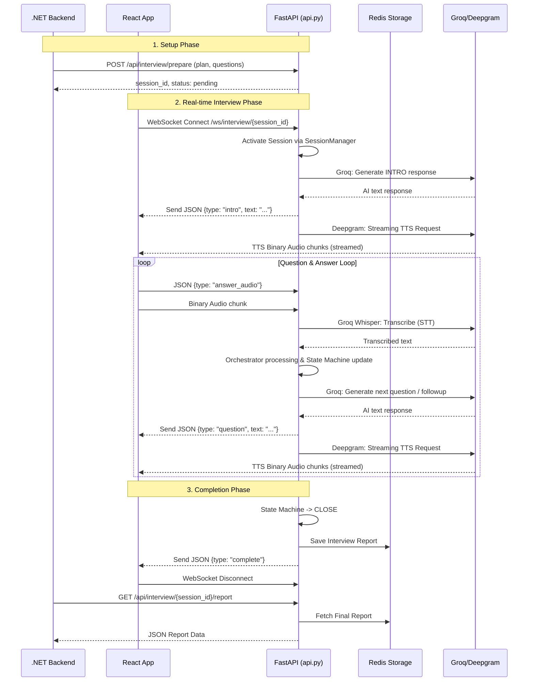
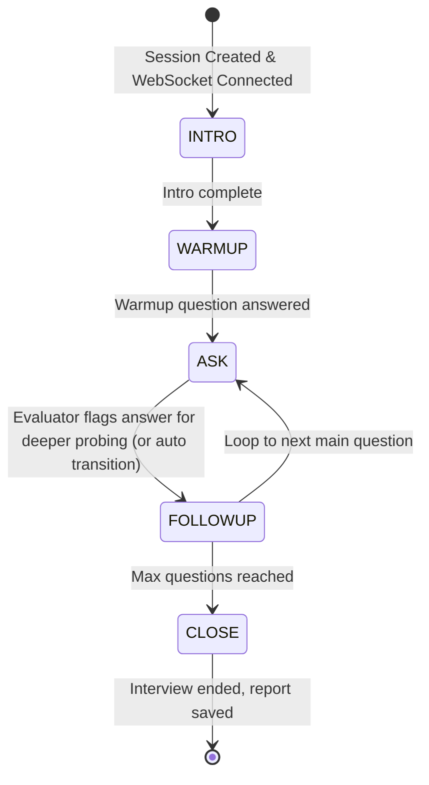

# Project Overview and Architecture

This project is a backend application for an **AI-driven Interview System**. It provides a fully automated interviewer agent that conducts live, voice-based technical interviews with candidates over WebSockets. The system acts as a middleware component, where an external service (like a .NET backend) prepares the interview session, and a frontend (React) connects to conduct the actual conversation in real-time.

---

## File-by-File Breakdown (Excluding Tests)

1. **`api.py` (FastAPI Server / Entry Point)**  
   Exposes the REST API and WebSocket interfaces. It handles:
   - **REST Endpoints:** Used by external backend systems to `POST /api/interview/prepare` (initialize a session with candidate info and questions) and `GET /api/interview/{session_id}/report` (fetch final evaluation results).
   - **WebSocket Endpoint:** `/ws/interview/{session_id}` where the frontend client connects. This endpoint processes real-time bidirectional communication: sending interviewer dialogue (JSON + binary TTS audio) and receiving candidate answers (JSON text or binary STT audio).

2. **`orchestrator.py` (The Interview Engine)**  
   Contains the `InterviewOrchestrator`, which manages the full lifecycle of a single interview session. It ties together the LLM (Groq API), the conversational history, and the state machine. It handles transitions between states (like INTRO, WARMUP, ASK, CLOSE), generates prompts for the Llama model, and compiles the final interview transcript and report.

3. **`state_machine.py` (Session Lifecycle)**  
   Defines the `InterviewStateMachine` which strictly controls how the interview flows through sequential phases:  
   `INTRO` -> `WARMUP` -> `ASK` -> `FOLLOWUP` -> `CLOSE`.  
   It ensures that the interview cannot perform illegal transitions.

4. **`conversation.py` (Context Manager)**  
   Manages the `ConversationHistory`, formatting the sequence of messages for the Groq LLM API. It injects context, maintains the conversational timeline, keeps the context window within limits (pruning older history if it exceeds 12 turns), and contains rules to evaluate if a candidate's answer requires a follow-up probe.

5. **`prompts.py` (LLM Persona & Instructions)**  
   Stores the System and User prompts that guide the behavior of the LLMs.
   - **Interviewer Agent:** Told to act as "Alex", a senior technical interviewer. It provides dynamic prompts formatted with candidate details for every state.
   - **Evaluator Agent:** An impartial grading engine that strictly compares candidate answers to "golden answers" without showing empathy or personality.

6. **`models.py` (Domain Data Structures)**  
   Contains the Pydantic models mapping the core concepts of the system, including `Candidate` details, `Score` metrics (with dimensions like correctness, completeness, clarity), `Answer` entries, and the top-level `Interview` session model.

7. **`session.py` (In-Memory State Management)**  
   Implements the `SessionManager`, tracking active and pending interviews in memory using dictionaries. It handles moving sessions from `PENDING` to `ACTIVE` (when WebSockets connect) and finally to `COMPLETED`, as well as cleaning up stale or abandoned sessions.

8. **`storage.py` (Persistence Layer)**  
   Implements a `HybridReportStorage` class. Once an interview is completed, it attempts to save the final report into Redis (for persistence). If Redis is unavailable or fails, it falls back to storing it directly in RAM within the `SessionManager`. 

9. **`stt.py` (Speech-To-Text)**  
   Wraps the Groq Whisper Large V3 API. It takes binary audio packets (from the candidate speaking over WebSocket) and transcribes them into text, which is then fed into the orchestrator logic. It handles language detection and injects technical keywords (based on the candidate's skills) as hints to improve Whisper accuracy.

10. **`tts.py` (Text-To-Speech)**  
    Wraps the Deepgram Aura TTS API. When the AI Interviewer generates a text response, this module converts it into natural-sounding speech (defaulting to the confident "aura-2-orion-en" voice). It supports both streaming (sending audio back chunk-by-chunk for near-instant playback) and full file synthesis.

11. **`interview_me.py` (CLI Testing Script)**  
    A standalone, interactive CLI application that runs the entire interview process in the terminal. You act as the candidate and type responses while the LLM acts as the interviewer and evaluates your text on the fly. It is completely independent of the FastAPI or WebSockets layer and acts as a sandbox.

---

## Architecture Diagrams

### 1. API Sequence Diagram
This diagram highlights the end-to-end integration flow between the external backend, the frontend UI, the AI models, and the core FastAPI layer.

### 2. Session Flow (State Machine)
This diagram illustrates the internal lifecycle of the `InterviewStateMachine` inside the application.

